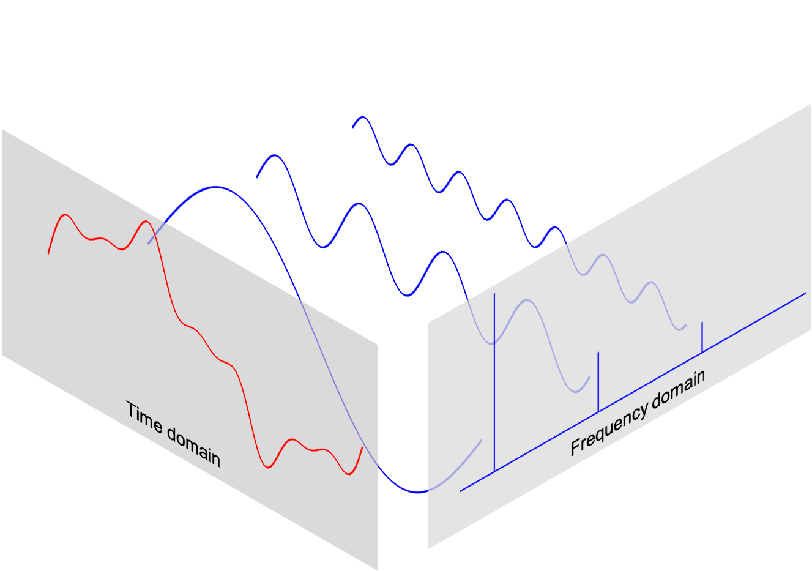
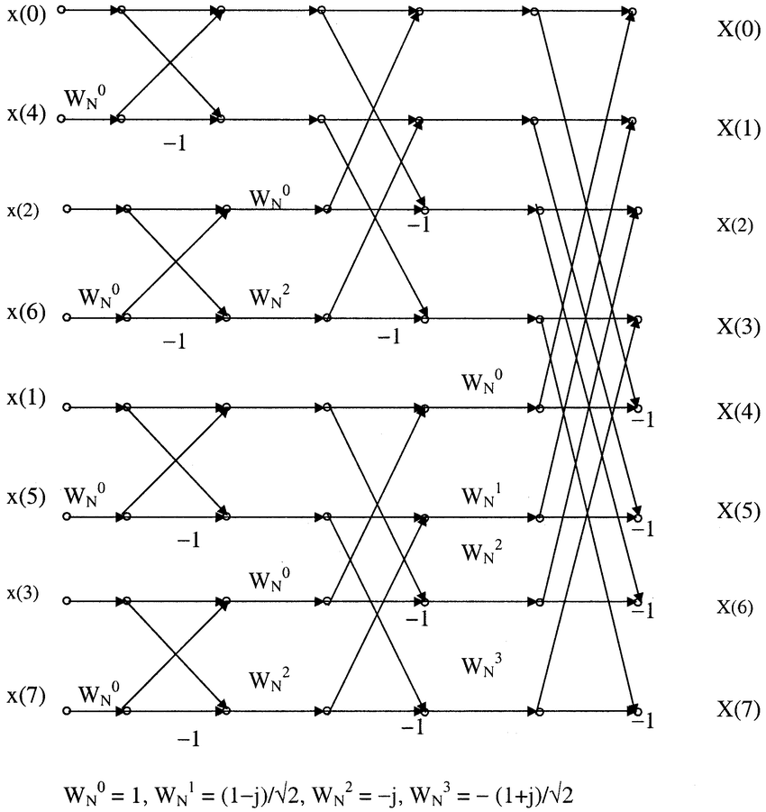

# FFT

FFT(Fast Fourier Transform)는 DFT(Discrete Fourier Transform)를 빠르게 계산하기 위한 알고리즘입니다. 음성 신호 처리에서는 시간 영역의 신호를 주파수 영역으로 변환해, 어떤 주파수 성분이 얼마나 포함되어 있는지 분석할 때 사용합니다.

## 함수의 이해

주기성을 가지는 신호는 여러 개의 sine, cosine 함수의 합으로 표현할 수 있습니다. 푸리에 변환은 이러한 관점에서 복잡한 파형을 단순한 주파수 성분으로 분해하는 방법입니다.

- 직선은 원의 특정 각도에서 원의 특정 점을 지나는 선으로 볼 수 있습니다.
- 원은 주기성을 가지는 움직임의 기본 단위로 이해할 수 있습니다.
- 주기성을 가지는 함수는 여러 sine 함수의 합으로 표현할 수 있습니다.
- 실제 음성 신호처럼 복잡한 파동도 여러 주파수 성분의 조합으로 분석할 수 있습니다.

## Fourier Transform

푸리에 변환(Fourier Transform)은 시간이나 공간에 대한 함수, 즉 신호를 다양한 주파수 성분의 합으로 분해하는 수학적 원리입니다. 신호를 주파수 도메인에서 바라보면 시간 파형만으로는 보이지 않는 주기성, 에너지 분포, 잡음 성분을 분석할 수 있습니다.

연속 시간 신호 `x(t)`의 푸리에 변환은 다음과 같이 표현합니다.

$$
X(f) = \int_{-\infty}^{\infty} x(t)e^{-j2\pi ft}dt
$$

직접 계산할 경우 시간 복잡도는 다음과 같습니다.

$$
O(N^2)
$$

## DFT

DFT(Discrete Fourier Transform)는 연속 신호가 아니라 이산적인 샘플에 대해 푸리에 변환을 계산하는 방법입니다. 디지털 오디오 신호는 샘플링을 통해 이산 데이터가 되므로, 실제 컴퓨터에서는 DFT 또는 FFT를 사용합니다.

DFT는 다음과 같이 정의됩니다.

$$
X[k] = \sum_{n=0}^{N-1} x[n]e^{-j2\pi kn/N}
$$

여기서 `X[k]`를 하나 계산하기 위해서는 모든 입력 샘플 `x[n]`을 사용해야 합니다. 이 계산을 모든 `k`에 대해 반복하므로 DFT의 시간 복잡도는 다음과 같습니다.

$$
O(N^2)
$$

## Fast Fourier Transform

FFT(Fast Fourier Transform)는 DFT와 같은 결과를 더 빠르게 계산하는 알고리즘입니다. 즉, FFT는 새로운 변환이 아니라 DFT를 효율적으로 계산하는 방법입니다.

- DFT와 FFT의 결과는 동일합니다.
- FFT는 DFT의 중복 계산을 줄입니다.
- 일반적인 FFT 알고리즘은 입력을 짝수 인덱스와 홀수 인덱스로 나누어 재귀적으로 계산합니다.
- 계산 복잡도는 `O(N^2)`에서 `O(N log N)`으로 줄어듭니다.

$$
O(N \log N)
$$

## Even / Odd Index Decomposition

FFT의 핵심 아이디어는 입력 샘플을 짝수 인덱스와 홀수 인덱스로 나누어 DFT를 계산하는 것입니다.

$$
X[k] =
\sum_{m=0}^{N/2-1} x[2m]e^{-j \frac{2\pi}{N}k(2m)}
+
\sum_{m=0}^{N/2-1} x[2m+1]e^{-j \frac{2\pi}{N}k(2m+1)}
$$

짝수 인덱스 항과 홀수 인덱스 항을 분리하면, 길이 `N`의 DFT 문제를 길이 `N/2`의 작은 DFT 문제 두 개로 나눌 수 있습니다.

## Exponential Simplification

짝수항은 다음과 같이 정리할 수 있습니다.

$$
E[k] = e^{-j \frac{2\pi}{N}k(2m)}
= e^{-j \frac{2\pi}{N/2}km}
$$

홀수항은 짝수항과 유사하지만 추가 회전 인자(twiddle factor)를 가집니다.

$$
O[k] =
e^{-j \frac{2\pi}{N}k(2m+1)}
=
e^{-j \frac{2\pi}{N/2}km}
e^{-j \frac{2\pi}{N}k}
$$

여기서 추가로 곱해지는 값은 다음과 같이 표현합니다.

$$
W_N^k = e^{-j \frac{2\pi}{N}k}
$$

## Recursive Decomposition

짝수항의 결과를 `E[k]`, 홀수항의 결과를 `O[k]`라고 하면 FFT는 다음과 같이 재귀적으로 계산됩니다.

$$
X[k] = E[k] + W_N^k O[k]
$$

$$
X[k + \frac{N}{2}] = E[k] - W_N^k O[k]
$$

두 번째 식은 첫 번째 식과 거의 같은 계산 결과를 재사용합니다. 차이는 `W_N^k` 항의 부호가 바뀌는 부분입니다.

그 이유는 다음 성질 때문입니다.

$$
W_N^{k + \frac{N}{2}}
= e^{-j \frac{2\pi}{N}(k + \frac{N}{2})}
= e^{-j \frac{2\pi}{N}k}e^{-j\pi}
= -e^{-j \frac{2\pi}{N}k}
$$

FFT는 위 성질을 이용해 같은 계산을 반복하지 않고, 작은 DFT 결과를 조합해 전체 DFT 결과를 만듭니다.

## 계산 예시

입력 길이가 `N = 8`인 경우, FFT는 다음과 같이 재귀적으로 분해됩니다.

1. 1단계: 길이 `8` 문제를 길이 `4` 문제 두 개로 분해합니다.
2. 2단계: 길이 `4` 문제를 길이 `2` 문제로 분해합니다.
3. 3단계: 길이 `2` 문제를 길이 `1` 문제로 분해합니다.

이처럼 `N`개의 샘플을 계속 절반으로 나누기 때문에 전체 단계 수는 `log N`이 되고, 각 단계에서 `N`개 수준의 조합 연산이 필요하므로 전체 시간 복잡도는 다음과 같습니다.

$$
O(N \log N)
$$

## 음성 신호 처리에서의 활용

FFT는 음성 신호 처리에서 매우 자주 사용됩니다.

- 시간 영역의 파형을 주파수 영역으로 변환합니다.
- Spectrogram, Mel-spectrogram, MFCC 계산의 기반이 됩니다.
- 특정 주파수 대역의 에너지 분포를 분석할 수 있습니다.
- 잡음 제거, 필터링, 음성 특징 추출에 활용됩니다.
- STFT(Short-Time Fourier Transform)는 짧은 프레임마다 FFT를 적용해 시간-주파수 표현을 만듭니다.

## 정리

DFT는 디지털 신호의 주파수 성분을 분석하는 기본 방법입니다. 하지만 직접 계산하면 `O(N^2)`의 연산량이 필요합니다. FFT는 DFT와 동일한 결과를 내면서 중복 계산을 줄여 `O(N log N)`으로 계산할 수 있게 해 주는 효율적인 알고리즘입니다.

음성 인식과 음성 분석에서는 FFT가 Spectrogram, Mel-spectrogram, MFCC 같은 핵심 특징 추출 과정의 출발점이 됩니다.
