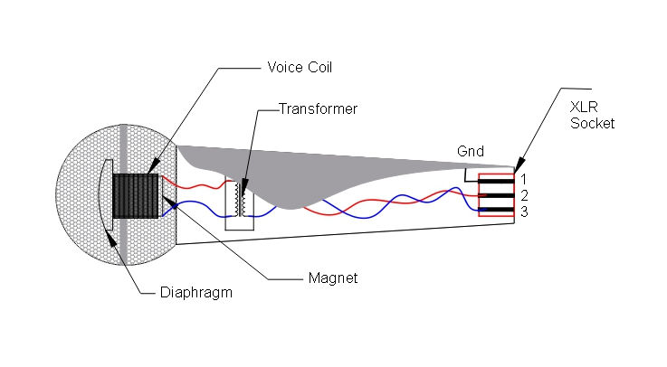
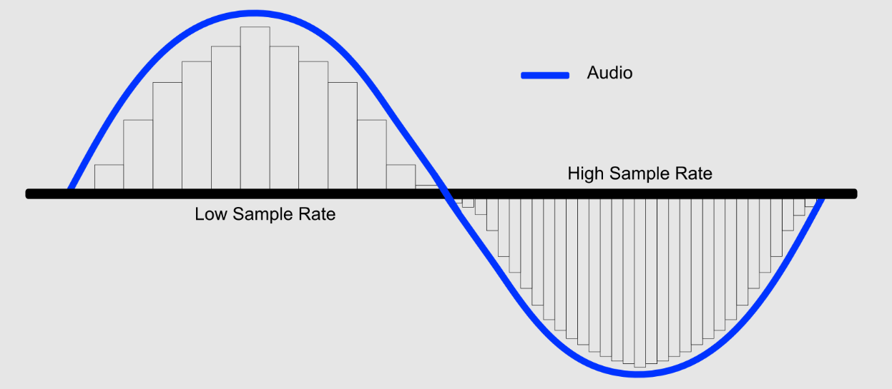

# 음성 신호 처리

## 음성 신호의 변환 과정

마이크를 통해 수집되는 오디오 신호는 **물리적 음압 → 전기 신호 → 디지털 신호**로 변환되는 일련의 과정을 거칩니다. 이 문서는 음성 신호가 컴퓨터에서 처리 가능한 데이터가 되기까지의 핵심 단계를 정리합니다.

### 물리적 음압

공기로 전파되는 소리는 공기의 압력 변화를 통해 전달됩니다. 이 음파는 시간에 따라 연속적으로 변화하는 아날로그 신호입니다.

주요 물리량은 다음과 같습니다.

- **주파수(Hz)**: 음파의 주기를 나타냅니다.
- **진폭(dB)**: 음파의 세기를 나타냅니다.
- **위상(rad)**: 음파의 위상을 나타냅니다.

### 전기 신호

이 압력 변화는 마이크의 진동수 응답을 통해 전기 신호로 변환됩니다. 이 전기 신호는 디지털 신호로 변환되어 컴퓨터에서 처리할 수 있습니다.

마이크는 디지털 신호로 변환하는 센서입니다. 다이어프램(Diaphragm) 센서는 얇은 판으로 공기의 압력 변화를 전기 신호로 변화시킵니다.

_마이크는 공기 압력 변화를 다이어프램의 움직임으로 받아들이고, 이를 전기 신호로 변환합니다._

### 마이크 타입

- **콘덴서 마이크**
  - 다이어프램 + 백플레이트를 통해 정전용량 변화를 감지
  - 민감도 높음, 저잡음
  - 전원 필요(Phantom power)
  - 스마트폰, IoT, 고급 음성 인식에 주로 사용
- **다이내믹 마이크**
  - 다이어프램 + 코일을 통해 전기 신호 변화 생성
  - 민감도 낮음, 내구성 높음
  - 별도 전원 불필요(Self-powered)
  - 일반적인 마이크로폰에 주로 사용
- **MEMS 마이크**
  - 실리콘 기반 초소형 콘덴서 마이크
  - 내구성 높음, 소음 저감에 유리
  - 소형 디바이스와 임베디드 음성 인터페이스에 주로 사용

### 아날로그 프론트엔드 (AFE)

아날로그 프론트엔드는 마이크에서 신호를 수집하고 전기 신호로 변환하는 회로입니다. 원신호를 디지털 신호로 변환하기 전에 저역 통과 필터 (LPF)와 고역 통과 필터 (HPF)를 통해 신호를 정제합니다.

- **Pre-amplifier**: 마이크 신호를 증폭하는 회로
- **Anti-aliasing filter**: 샘플링 전에 불필요한 고주파 성분을 제거하는 회로
- **Gain control**: 신호의 세기를 조절하는 회로
- **Bias tee**: 신호의 바이어스를 제공하는 회로
- **Output buffer**: 신호를 안정적으로 출력하는 회로

### ADC (Analog-to-Digital Converter)

ADC는 아날로그 신호를 디지털 신호로 변환하는 회로입니다. 아날로그 신호를 디지털 신호로 변환하기 전에 AFE를 통해 신호를 정제합니다.

- **Sample and hold**: 특정 시점의 신호 값을 샘플로 고정
- **Quantization**: 샘플의 진폭을 제한된 단계의 숫자 값으로 변환
- **Coding**: 양자화된 값을 저장·전송 가능한 디지털 형식으로 표현

### Sampling rate (Hz)

Sampling rate는 아날로그 신호를 디지털 신호로 변환하는 비율입니다. 1초당 샘플링되는 횟수를 나타냅니다. 예를 들어, 16kHz는 1초당 16,000번 샘플링됩니다. Sampling rate는 오디오의 품질을 결정하는 중요한 요소입니다. 높은 Sampling rate는 더 많은 정보를 담을 수 있지만, 더 많은 데이터를 처리해야 합니다.

_Sampling rate가 높을수록 연속적인 아날로그 파형을 더 촘촘하게 샘플링할 수 있습니다._

유효 주파수를 이해하기 위해서는 [Nyquist-Shannon sampling theorem](https://en.wikipedia.org/wiki/Nyquist%E2%80%93Shannon_sampling_theorem)을 이해해야 합니다. 이 정리에 따르면 원 신호를 손실 없이 표현하려면, 신호에 포함된 가장 높은 주파수의 최소 2배 이상으로 샘플링해야 합니다.

_샘플링 주파수가 충분하지 않으면 원 신호와 다른 주파수 성분이 나타나는 aliasing 문제가 발생할 수 있습니다._

| Sampling rate | 유효 주파수 대역 | 주요 용도 | 특징 |
| --- | --- | --- | --- |
| **8 kHz** | 0 ~ 4 kHz | 전화 음성 인식, 콜센터 STT, 통화 녹취 분석 | 데이터 크기가 작고 실시간 처리에 유리하지만, 고주파 성분 손실로 음질과 인식 정확도에 한계가 있습니다. |
| **16 kHz** | 0 ~ 8 kHz | 일반 ASR, 모바일 STT, 서버 기반 음성 AI | 사람 음성의 핵심 정보 대부분을 포함하며, 정확도와 연산 비용의 균형이 좋아 음성 인식에서 사실상 표준으로 사용됩니다. |
| **44.1 kHz / 48 kHz** | 0 ~ 22.05 kHz / 0 ~ 24 kHz | 음악, 방송, 스튜디오 녹음, 음성 품질 평가 | 고음질 오디오와 정밀 분석에 적합하지만, 대부분의 ASR에서는 16 kHz로 다운샘플링됩니다. |
| **96 kHz / 192 kHz** | 0 ~ 48 kHz / 0 ~ 96 kHz | 음향 계측, 초음파, TTS/vocoder 연구 | 인간 가청 대역을 초과하는 정보를 포함하지만, 데이터 크기와 연산 비용이 매우 커 일반 음성 인식에는 거의 사용되지 않습니다. |

### Quantization

Quantization(양자화)는 마이크를 통해 수집된 아날로그 오디오 신호의 크기(진폭)를 일정한 단계로 나누어 숫자로 표현하는 과정입니다. 아날로그 신호는 연속적인 값이지만, 컴퓨터와 같은 디지털 시스템에서는 이를 그대로 처리할 수 없기 때문에 각 시점의 신호 크기를 가장 가까운 숫자 값으로 변환하여 저장하게 됩니다.

이 과정에서 사용되는 비트 수가 많을수록 표현 가능한 단계가 더 세밀해져 원래의 소리를 보다 정확하게 표현할 수 있습니다. 반대로 비트 수가 적을 경우에는 작은 소리의 변화가 충분히 표현되지 못해 약간의 오차가 발생하며, 이는 양자화 잡음으로 나타날 수 있습니다.

정리하면, 양자화는 아날로그 소리를 디지털 숫자로 변환하는 핵심 단계로서, 이 단계의 정밀도가 디지털 오디오의 품질뿐만 아니라 이후 음성 인식이나 신호 처리 성능에도 중요한 영향을 미칩니다.

음성인식에서는 16bit 양자화가 일반적으로 사용됩니다. 16bit 양자화는 65,536단계의 표현이 가능하며, 이는 소리의 세기를 매우 정밀하게 표현할 수 있습니다.

### Codec

Coding(코딩)은 양자화까지 완료된 디지털 오디오 데이터를 정해진 규칙에 따라 표현하고 저장하거나 전송하기에 적합한 형태로 변환하는 과정입니다. 쉽게 말씀드리면, 이미 숫자로 바뀐 오디오 신호를 어떤 형식과 구조로 다룰지 정하는 단계라고 이해하시면 됩니다.

오디오 신호는 양자화를 거치면 숫자의 나열(PCM 데이터)이 되는데, 이 데이터를 그대로 사용할 수도 있고, 저장 공간이나 전송 효율을 높이기 위해 특정한 규칙으로 다시 표현할 수도 있습니다. 이때 적용되는 규칙이 바로 코딩 방식입니다. 예를 들어, PCM 데이터를 파일로 저장할 때 WAV 형식을 사용하면 샘플률, 비트 수, 채널 정보 등을 함께 구조화하여 기록하게 되며, 이는 코딩의 한 형태입니다.

또한 코딩은 압축과도 밀접한 관련이 있습니다. MP3, AAC와 같은 오디오 포맷은 사람이 잘 인식하지 못하는 정보를 줄이거나 반복되는 패턴을 효율적으로 표현하여 데이터 크기를 크게 줄입니다. 반면, 음성 인식이나 신호 처리에서는 보통 압축 손실이 없는 PCM 코딩이나 FLAC과 같은 무손실 코딩을 사용하여 원 신호의 정보를 최대한 보존합니다.

정리하면, 코딩은 디지털로 변환된 오디오 신호를 저장·전송·처리에 적합한 형식으로 정리하는 단계이며, 이 단계에서 선택되는 코딩 방식에 따라 음질, 데이터 크기, 시스템 성능이 크게 달라지게 됩니다.

### Codec 타입

Codec(코덱)은 COder + DECoder의 합성어로, 코딩 방식을 실제로 구현한 소프트웨어 또는 하드웨어를 의미합니다. 예를 들어, WAV 형식은 PCM 코딩을 파일 형식으로 구조화한 대표적인 예입니다.

- **압축 여부 기준**
  - 무압축 코덱: PCM(WAV). 음질 손실이 없고 연산 부담이 적어 ASR과 신호 분석에 적합합니다.
  - 무손실 압축 코덱: FLAC, ALAC. 원본을 완전히 복원할 수 있어 음원 보관과 아카이빙에 사용됩니다.
  - 손실 압축 코덱: MP3, AAC, Opus. 데이터 용량을 크게 줄일 수 있어 스트리밍과 통신에 사용됩니다.
- **신호 모델 기준**
  - 파형 기반 코덱: PCM, ADPCM. 구조가 단순하고 지연이 낮아 실시간 처리와 임베디드 환경에 적합합니다.
  - 변환 기반 코덱: MP3, AAC. 주파수 변환을 사용해 높은 압축 효율을 제공합니다.
  - 음성 모델 기반 코덱: AMR, EVS, LPC. 음성에 특화되어 이동통신과 VoIP에서 사용됩니다.
- **비트레이트 기준**
  - 고정 비트레이트(CBR): 데이터율이 일정해 방송과 통신처럼 안정적 전송이 중요한 환경에 적합합니다.
  - 가변 비트레이트(VBR): 신호 복잡도에 따라 비트레이트를 조절해 저장과 스트리밍 효율을 높입니다.
- **지연 특성 기준**
  - 저지연 코덱: PCM, Opus. 실시간 통화나 Voice Agent에 적합합니다.
  - 고지연 코덱: MP3, AAC. 압축 효율은 좋지만 실시간 대화보다는 음원 재생에 적합합니다.

### DSP (Digital Signal Processing)

디지털 신호 처리는 디지털 신호를 처리하는 회로입니다. 디지털 신호를 처리하기 전에 저역 통과 필터 (LPF)와 고역 통과 필터 (HPF)를 통해 신호를 정제합니다.

- **Filtering**: 신호를 필터링하는 회로
- **Feature extraction**: 신호에서 특징을 추출하는 회로
