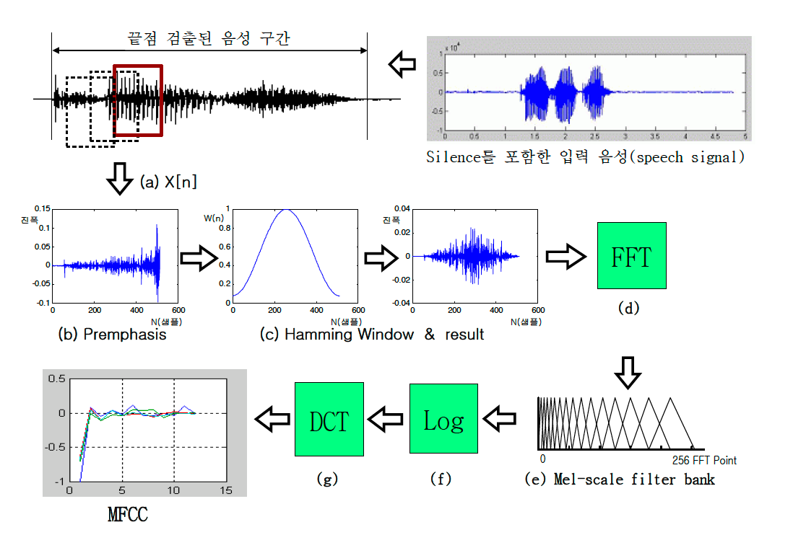

# 음성 신호 처리

음성 신호 처리는 마이크로 입력되어 디지털로 변환된 음성 데이터를 분석, 인식, 합성, 분류에 적합한 형태로 가공하는 과정입니다. 일반적인 처리 흐름은 **Pre-processing → Framing & Windowing → Feature extraction → Post-processing** 순서로 구성됩니다.

## 주요 처리 흐름

| 단계 | 설명 | 목적 |
| --- | --- | --- |
| Pre-processing | 원음 신호에 포함된 잡음, 채널 차이, 음량 편차 등을 보정합니다. | 안정적인 입력 신호 확보 |
| Framing & Windowing | 연속 신호를 짧은 프레임으로 나누고 윈도우 함수를 적용합니다. | 시간에 따라 변하는 음성 특성 분석 |
| Feature extraction | 프레임 단위 신호에서 모델이 활용할 특징을 추출합니다. | 음성의 핵심 정보 표현 |
| Post-processing | 추출된 특징을 정규화하거나 길이, 차원, 시간적 변화를 보정합니다. | 학습과 추론 안정성 향상 |

## MFCC와 Mel-spectrogram

MFCC(Mel-Frequency Cepstral Coefficients)는 인간의 청각 특성을 반영한 Mel scale과 cepstral 분석을 결합한 대표적인 음성 특징입니다.

Mel-spectrogram은 위 과정에서 **Mel-scale filter bank** 결과를 특징으로 사용하는 방식입니다. 최근 딥러닝 기반 음성 모델에서는 MFCC보다 Mel-spectrogram을 직접 입력으로 사용하는 경우가 많습니다.

## Pre-processing

Pre-processing은 원음 신호에 포함된 잡음이나 불필요한 성분을 제거하고, 모델이나 분석 시스템이 기대하는 입력 조건에 맞게 신호를 정제하는 단계입니다.

### 샘플링과 채널 정리

- **Resampling**: 입력 오디오의 샘플링 레이트를 모델 또는 시스템 기준으로 통일합니다. ASR에서는 보통 16 kHz가 많이 사용됩니다.
- **Channel conversion**: 스테레오 입력을 모노로 합치거나 특정 채널만 선택합니다. 많은 음성 인식 모델은 모노 입력을 가정합니다.
- **DC offset removal**: 신호에 포함된 직류 성분, 즉 평균값을 제거해 파형이 0을 중심으로 분포하도록 보정합니다.

### 신호 보정

- **Pre-emphasis**: 고주파 성분을 상대적으로 강조해 자음이나 발음의 선명한 정보를 더 잘 드러나게 합니다.
- **Normalization**: 화자 거리, 녹음 장비, 발화 습관에 따른 음량 차이를 줄이기 위해 진폭 스케일을 일정 기준으로 맞춥니다.
- **Automatic gain control (AGC)**: 입력 음량이 너무 작거나 큰 경우 자동으로 증폭 또는 감쇠해 적정 레벨을 유지합니다.
- **Clipping detection / handling**: ADC 범위를 넘어 발생한 클리핑을 탐지하고, 해당 구간을 마스킹하거나 재녹음을 유도하는 방식으로 처리합니다.

### 잡음과 환경 보정

- **Band-pass / high-pass filtering**: 특정 주파수 대역만 남기거나 제거합니다. 저주파 진동이나 바람 소리를 줄일 때 high-pass filter를 사용할 수 있습니다.
- **Noise reduction**: 배경 소음, 팬 소리, 도로 소음, 전기 잡음 등을 줄여 SNR(Signal-to-Noise Ratio)을 개선합니다.
- **Dereverberation**: 실내 반사로 인해 생기는 잔향을 줄입니다. 원거리 ASR에서 특히 중요합니다.
- **Echo cancellation**: 스피커 출력이 다시 마이크로 들어와 생기는 에코를 제거합니다. 통화나 Voice Agent 환경에서 자주 사용됩니다.
- **Voice activity detection (VAD)**: 입력 신호에서 실제 음성이 존재하는 구간만 검출합니다. 무음 구간을 제외해 계산 비용과 오인식 가능성을 줄입니다.
- **Beamforming**: 여러 개의 마이크를 사용해 특정 방향의 소리를 강화하고 다른 방향의 소리를 억제합니다.
- **Voice separation**: 혼합된 음원에서 음성 또는 특정 화자 음성을 분리합니다.

## Framing & Windowing

음성은 시간에 따라 빠르게 변하지만, 매우 짧은 구간에서는 비교적 안정적인 신호로 볼 수 있습니다. Framing & Windowing은 이 특성을 이용해 전체 신호를 짧은 프레임으로 나누고, 각 프레임에 윈도우 함수를 적용해 주파수 분석이 가능하도록 만드는 과정입니다.

- **Framing**: 신호를 20 ms ~ 40 ms 정도의 짧은 구간으로 나눕니다.
- **Hop size**: 다음 프레임으로 이동하는 간격입니다. 일반적으로 10 ms ~ 20 ms를 사용합니다.
- **Sliding window**: 프레임을 일정 간격으로 이동시키며 연속적인 시간 정보를 보존합니다.
- **Windowing**: 프레임 경계에서 발생하는 불연속성과 spectral leakage를 줄이기 위해 윈도우 함수를 적용합니다.

## Window Function

Window function은 프레임 경계에서 발생하는 왜곡을 줄이기 위해 각 샘플에 가중치를 곱하는 함수입니다.

| Window | 수식 | 특징 |
| --- | --- | --- |
| Hamming | `w(n) = 0.54 - 0.46 * cos(2 * pi * n / N)` | 음성 처리에서 널리 사용되며 주파수 누설을 줄이는 데 효과적입니다. |
| Hanning | `w(n) = 0.5 - 0.5 * cos(2 * pi * n / N)` | 부드러운 경계를 제공하며 일반적인 스펙트럼 분석에 사용됩니다. |
| Blackman | `w(n) = 0.42 - 0.5 * cos(2 * pi * n / N) + 0.08 * cos(4 * pi * n / N)` | sidelobe 억제가 강하지만 주파수 해상도가 낮아질 수 있습니다. |
| Kaiser | `w(n) = I0(beta * sqrt(1 - (2 * n / N - 1)^2)) / I0(beta)` | beta 값으로 특성을 조절할 수 있습니다. |
| Rectangular | `w(n) = 1` | 별도 가중치를 적용하지 않는 방식으로, 경계 왜곡에 취약합니다. |

## Window Size와 Hop Size

Window size와 hop size는 음성 신호 처리에서 중요한 파라미터입니다. 일반적으로 window size는 **20 ms ~ 40 ms**, hop size는 **10 ms ~ 20 ms** 사이를 사용합니다. 보통 hop size는 window size의 1/2 또는 1/4 수준으로 설정합니다.

| 파라미터 | 일반적인 값 | 영향 |
| --- | --- | --- |
| Window size | 20 ms ~ 40 ms | 길수록 주파수 해상도가 좋아지고, 짧을수록 시간 해상도가 좋아집니다. |
| Hop size | 10 ms ~ 20 ms | 작을수록 프레임이 촘촘해져 시간 정보가 세밀해지지만 계산량이 증가합니다. |

## Feature Extraction

Feature extraction은 프레임 단위로 처리된 신호에서 음성의 핵심 정보를 추출하여, 인식이나 분석에 적합한 특징 벡터로 변환하는 단계입니다.

| Feature | 주요 특징 | 의미 / 활용 |
| --- | --- | --- |
| **Energy** | 신호의 전체적인 크기 측정 | 발화/무음 구간 구분, VAD |
| **Spectral features** | 주파수 영역의 에너지 분포 | 음색, 화자, 감정, 환경 분석 |
| **Pitch** | 기본 주파수(F0) 측정 | 억양, 감정, 화자 특성 분석 |
| **Loudness** | 청각 특성을 반영한 음량 측정 | 사람이 느끼는 음량 추정 |
| **MFCC** | Mel scale과 cepstral 기반의 압축된 주파수 특징 | 전통적인 ASR의 대표 입력 특징 |
| **Mel-spectrogram** | Mel scale로 변환된 스펙트로그램 | 딥러닝 음성 모델의 대표 입력 특징 |
| **Spectrogram** | 시간에 따른 주파수 에너지 분포 | 음성 구조 시각화, 이벤트 분석 |
| **Spectral centroid** | 스펙트럼 에너지의 중심 주파수 | 소리의 밝음 판단 |
| **Spectral bandwidth** | 스펙트럼 에너지의 퍼짐 정도 | 소리의 복잡도와 거칠기 분석 |
| **Spectral rolloff** | 누적 에너지의 일정 비율이 되는 주파수 | 고주파 성분과 음색의 날카로움 판단 |
| **Spectral flatness** | 스펙트럼의 평탄함 정도 | 잡음성 신호와 하모닉 신호 구분 |
| **Spectral contrast** | 대역별 peak와 valley의 차이 | 하모닉 구조와 음색 대비 표현 |
| **Spectral spread** | centroid 기준 에너지 분산 | 주파수 에너지 분포 범위 분석 |
| **Spectral skewness** | 스펙트럼 분포의 비대칭성 | 저주파/고주파 치우침 판단 |
| **Spectral kurtosis** | 스펙트럼 분포의 뾰족함 | 특정 주파수 집중 여부 판단 |

## Post-processing

Post-processing은 feature extraction 이후 단계에서 수행되는 처리입니다. 추출된 특징을 더 안정적이고 일관된 형태로 정제하여 모델 학습과 추론 성능을 높이는 것이 목적입니다.

- **Feature normalization**: 추출된 특징 값의 범위를 일정하게 맞춥니다. 모델이 특정 스케일에 과도하게 의존하는 것을 줄일 수 있습니다.
- **Mean / variance normalization (CMVN)**: 특징의 평균을 0, 분산을 1로 맞춥니다. 채널 특성, 녹음 환경, 화자 차이로 인한 분포 편차를 줄입니다.
- **Temporal smoothing**: 시간 축 방향으로 특징 값을 부드럽게 만들어 순간적인 잡음이나 급격한 변화를 완화합니다.
- **Delta / delta-delta features**: 정적인 특징에 1차 변화량과 2차 변화량을 추가해 음성의 동적 특성을 반영합니다.
- **Feature stacking / splicing**: 인접한 여러 프레임의 특징을 하나의 벡터로 묶어 시간 문맥을 함께 활용합니다.
- **Dimensionality reduction**: PCA, LDA 등을 사용해 특징 차원을 줄이고 계산 비용과 모델 복잡도를 낮춥니다.
- **Feature selection**: 모델 성능에 기여도가 높은 특징만 선택해 일반화 성능과 학습 안정성을 높입니다.
- **Outlier handling**: 센서 오류, 순간 잡음, 클리핑 등으로 발생한 이상치를 완화하거나 제거합니다.
- **Padding / truncation**: 입력 길이를 모델 요구 조건에 맞춥니다. 배치 처리와 실시간 추론에서 필수적입니다.
- **Sequence aggregation**: 프레임 단위 특징을 평균, 최대값, 통계량 등으로 요약해 발화 단위 특징을 생성합니다.
