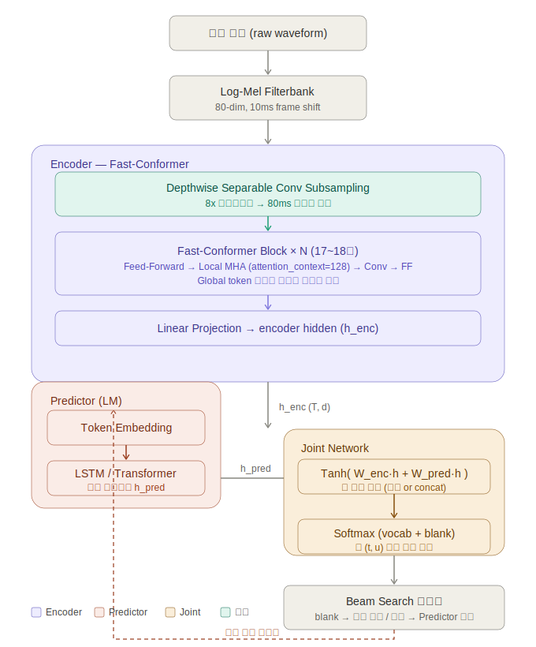
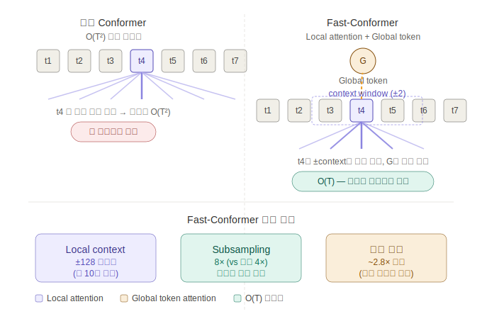

# Fast-Conformer

Fast-Conformer는 NVIDIA NeMo에서 제공하는 Conformer 계열 음성 인식 모델입니다. 기존 Conformer의 정확도를 유지하면서 연산량과 지연 시간을 줄이는 데 초점을 둔 구조로, 온프레미스 STT, 실시간 스트리밍 ASR, 도메인 특화 파인튜닝에 적합합니다.

## 핵심 요약

| 항목 | 내용 |
| --- | --- |
| 모델 계열 | Conformer 기반 ASR encoder |
| 주요 목적 | 고정확도 음성 인식과 실시간 추론 비용 절감 |
| 대표 디코더 | RNN-T, CTC |
| 강점 | 스트리밍 추론, 낮은 지연 시간, TensorRT 최적화, Apache 2.0 라이선스 모델 활용 가능 |
| 주요 활용 | 실시간 STT, 콜센터 음성 인식, Voice Agent, 온프레미스 음성 인식 |

## 배경

Conformer는 CNN과 Transformer를 결합한 음성 인식 구조입니다. CNN은 음성의 지역적 패턴을 잘 포착하고, self-attention은 긴 문맥 정보를 반영하는 데 강점이 있습니다. 다만 일반 Conformer는 attention 계산 비용이 크고, 실시간 스트리밍 환경에서는 전체 문맥을 볼 수 없기 때문에 지연 시간과 메모리 사용량이 문제가 될 수 있습니다.

Fast-Conformer는 이러한 문제를 줄이기 위해 다음 방향으로 개선된 구조입니다.

- 더 효율적인 subsampling으로 시퀀스 길이를 줄입니다.
- attention 계산 범위를 제한해 연산량을 줄입니다.
- streaming inference에 적합하도록 cache-aware 구조를 사용할 수 있습니다.
- RNN-T와 결합해 online decoding을 수행할 수 있습니다.

## 아키텍처 개요

Fast-Conformer 기반 STT 시스템은 일반적으로 다음 단계로 구성됩니다.

1. 입력 오디오를 Mel-spectrogram 또는 유사한 음성 특징으로 변환합니다.
2. Fast-Conformer encoder가 시간 축 특징을 문맥화합니다.
3. RNN-T 또는 CTC decoder가 토큰 시퀀스를 예측합니다.
4. 후처리 단계에서 문장부호, 대소문자, 도메인 용어 정규화 등을 적용합니다.

## RNN-T 구조

RNN-T(Recurrent Neural Network Transducer)는 streaming ASR에 많이 사용되는 디코더 구조입니다. 입력 오디오를 모두 본 뒤 결과를 내는 offline decoder와 달리, 음성이 들어오는 동안 점진적으로 토큰을 예측할 수 있습니다.

RNN-T는 크게 세 부분으로 구성됩니다.

- **Encoder**: 오디오 특징을 시간 순서의 hidden representation으로 변환합니다. Fast-Conformer가 이 역할을 수행합니다.
- **Prediction network**: 이전에 출력된 토큰들을 바탕으로 다음 토큰 예측에 필요한 언어적 문맥을 제공합니다.
- **Joint network**: encoder 출력과 prediction network 출력을 결합해 최종 토큰 확률을 계산합니다.

이 구조는 실시간 인식에 유리하지만, 학습과 디코딩이 CTC보다 복잡하고 beam search 설정에 따라 정확도와 지연 시간이 달라질 수 있습니다.

## Local vs Global Attention

기본 self-attention은 모든 time step이 서로를 참조하기 때문에 긴 음성 입력에서 계산량이 크게 증가합니다. Fast-Conformer는 local attention을 활용해 각 time step이 제한된 주변 문맥만 보도록 구성할 수 있습니다.

| 방식 | 특징 | 장단점 |
| --- | --- | --- |
| Global attention | 전체 구간의 문맥을 참조합니다. | 정확도에는 유리하지만, 긴 입력에서 계산량과 메모리 사용량이 큽니다. |
| Local attention | 일정 범위의 주변 문맥만 참조합니다. | 계산량이 줄고 streaming에 유리하지만, 긴 문맥 정보가 제한될 수 있습니다. |

실시간 STT에서는 전체 발화가 끝날 때까지 기다릴 수 없기 때문에 local attention과 chunk 기반 처리가 중요합니다. 반면 offline batch transcription에서는 global context를 더 많이 활용하는 구성이 정확도에 유리할 수 있습니다.

## Streaming ASR에서의 장점

Fast-Conformer는 실시간 음성 인식 시스템에서 다음과 같은 장점을 가집니다.

- **낮은 지연 시간**: chunk 단위 입력과 RNN-T decoding을 통해 발화 도중 결과를 생성할 수 있습니다.
- **효율적인 추론 비용**: local attention과 subsampling을 통해 긴 음성 입력의 연산량을 줄일 수 있습니다.
- **온프레미스 배포 적합성**: NVIDIA GPU, TensorRT, Triton Inference Server와의 조합으로 서빙 최적화가 용이합니다.
- **도메인 파인튜닝 용이성**: NeMo 기반 학습 파이프라인을 활용해 특정 도메인 음성 데이터로 재학습할 수 있습니다.
- **라이선스 측면의 유리함**: Apache 2.0 계열 체크포인트를 선택하면 상용 배포 부담이 상대적으로 낮습니다.

## 한계와 고려사항

Fast-Conformer를 상용 STT에 적용할 때는 다음 사항을 함께 고려해야 합니다.

- **데이터 의존성**: 코드스위칭, 전문 용어, 고유명사, 도메인 발화는 자체 데이터 확보와 파인튜닝 품질에 크게 좌우됩니다.
- **언어 모델 보강 필요성**: 도메인 용어 오류를 줄이려면 shallow fusion, contextual biasing, 후처리 정규화가 필요할 수 있습니다.
- **Streaming 정확도 저하**: offline 모델보다 볼 수 있는 문맥이 제한되므로, chunk 크기와 look-ahead 설정이 중요합니다.
- **튜닝 복잡도**: beam size, decoding strategy, latency budget, batching 정책에 따라 실제 성능이 달라집니다.
- **체크포인트별 라이선스 확인**: 같은 Fast-Conformer 계열이라도 공개 모델별 라이선스와 학습 데이터 조건을 확인해야 합니다.

## 적용 전략

한영 코드스위칭 STT 시스템에서는 Fast-Conformer를 다음과 같이 적용하는 전략이 현실적입니다.

1. 공개 Fast-Conformer 체크포인트로 baseline WER과 latency를 측정합니다.
2. 도메인 음성 데이터를 수집하고 한국어/영어 혼용 발화를 포함해 라벨링합니다.
3. 통합 tokenizer 또는 BPE vocabulary를 구성해 코드스위칭 발화를 하나의 모델에서 처리합니다.
4. Fast-Conformer RNN-T를 파인튜닝하고, 도메인 용어 오류를 별도 분석합니다.
5. TensorRT와 Triton 기반으로 추론 최적화를 수행합니다.
6. 실시간 환경에서 chunk size, look-ahead, beam size, batching 정책을 조정합니다.

## 평가 지표

| 지표 | 설명 |
| --- | --- |
| WER | 단어 오류율. STT 정확도를 평가하는 핵심 지표입니다. |
| CER | 문자 오류율. 한국어처럼 띄어쓰기 기준이 애매한 언어에서 함께 확인할 수 있습니다. |
| RTF | Real Time Factor. 1보다 작으면 실시간보다 빠르게 처리할 수 있음을 의미합니다. |
| Latency | 음성 입력 후 텍스트가 출력되기까지의 지연 시간입니다. |
| Throughput | GPU 1장 기준 동시 처리 가능한 스트림 수입니다. |

## 결론

Fast-Conformer는 실시간성과 상용 배포 가능성을 모두 고려해야 하는 STT 시스템에서 강한 후보입니다. 특히 온프레미스 환경, GPU 최적화, 도메인 파인튜닝, streaming inference가 중요한 경우 Whisper 계열 offline 모델보다 운영 관점에서 유리합니다.

다만 최종 성능은 모델 구조보다 데이터 품질에 더 크게 좌우됩니다. 따라서 Fast-Conformer를 상용 시스템에 적용할 때는 모델 선택과 함께 도메인 데이터 확보, 코드스위칭 라벨링, 용어 정규화, latency 튜닝을 하나의 파이프라인으로 설계해야 합니다.
